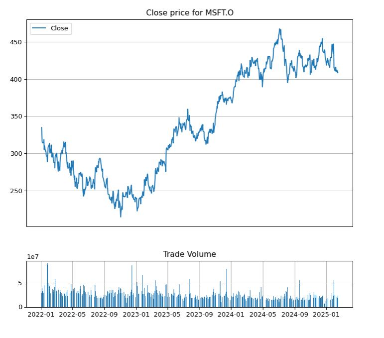
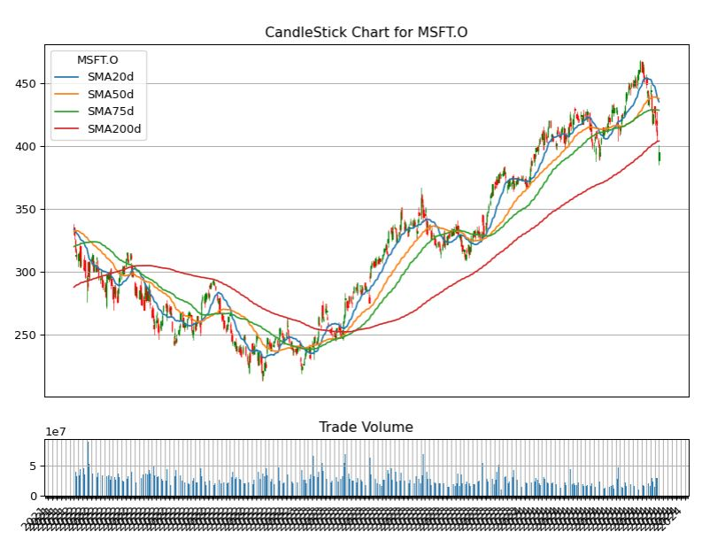

# Generate CandleStick Chart using TimeSeries data from LSEG Data Library for Python

## Overview

Basically, [LSEG Data Library for Python](https://developers.lseg.com/en/api-catalog/lseg-data-platform/lseg-data-library-for-python) provides the functionality to request a historical data so users can use the data for fundamental historical data analysis or technical analysis. They can also use the data to illustrate market movements. 

The Japanese candlestick chart and open-high-low-close chart (also OHLC) commonly used to illustrate movements in the price of a financial instrument over time. It's popular in finance and some strategies in technical analysis use them to make trading decisions, depending on the shape, color, and position of the candles. Although the Eikon user can use this kind of chart on Eikon Desktop, the API is a choice for a user who wants to use their own algorithm and calculation to generate a graph for technical analysis.

This example demonstrates how to request the Time Series data from [LSEG Data Library for Python](https://developers.lseg.com/en/api-catalog/lseg-data-platform/lseg-data-library-for-python) and plot a simple graphs for basic technical analysis. And it also provide sample codes to generate an OHLC CandleStick chart and then plotting a Moving average to the graph. The user can use their own algorithm to make a decision based on the result from the graph and OHLC CandleStick chart. Note that this example does not cover the part to analyze the graph.

## Packages Required

User must [install LSEG Data Library for Python](https://developers.lseg.com/en/api-catalog/lseg-data-platform/lseg-data-library-for-python/quick-start#getting-started-with-python) and it requires __pandas__, __matplotlib__, __ipympl__, and __candlestick_ohlc__ from __mplfinance__ to process and visualize the stock data returned from the Eikon data API. We also use a method __histplot__ from __seaborn__ package to plot a histogram to see a distribution of the price.

```python
import lseg.data as ld
from lseg.data.errors import LDError
import matplotlib.pyplot as plt
import pandas as pd
import numpy as np
from matplotlib import dates
from mplfinance.original_flavor import candlestick_ohlc
from datetime import datetime
from pandas.plotting import register_matplotlib_converters
import seaborn as sns
from matplotlib.dates import DateFormatter, WeekdayLocator,DayLocator, MONDAY
```


## Retrieve a Time Series data using LSEG Data Library for Python

To use LSEG Data Library for Python, users have to start desktop applications (Eikon or LSEG Workspace) and they must install the LSEG Data Library for Python and then generate AppID at the first step. Please find the following [quick start guide](https://developers.lseg.com/en/api-catalog/lseg-data-platform/lseg-data-library-for-python/quick-start) to install the LSEG Data Library for Python. The examples are available on [GitHub](https://github.com/LSEG-API-Samples/Example.DataLibrary.Python/tree/lseg-data-examples).

To request a TimeSeries data, a developer can use the [get_history](https://github.com/LSEG-API-Samples/Example.DataLibrary.Python/blob/lseg-data-examples/Examples/1-Access/EX-1.01.02-GetHistory.ipynb) method.
Typically, user can specify RIC name, a period of times/interval and a field list such as OPEN_PRC, HIGH_1, LOW_1 and TRDPRC_1 price when requesting the data.

```python
import lseg.data as ld
from lseg.data.errors import LDError
import matplotlib.pyplot as plt
import pandas as pd
import numpy as np
from matplotlib import dates
from mplfinance.original_flavor import candlestick_ohlc
from datetime import datetime
from pandas.plotting import register_matplotlib_converters
register_matplotlib_converters()
%matplotlib inline

try:    
    ld.open_session(app_key = '<AppKey>')
    itemName="MSFT.O"
    dateStart="2020-01-01"
    dateEnd=datetime.now()

    # request time series data with adjusted close price
    df_adjustOHLC = ld.get_history(
        universe=['MSFT.O'],
        fields = ['OPEN_PRC','HIGH_1','LOW_1','TRDPRC_1','ACVOL_UNS'],
        adjustments=['exchangeCorrection','manualCorrection','CCH','CRE','RPO','RTS'],
        start=dateStart,
        end=dateEnd)

except LDError as ex:
    print('LSEG Data Error')
    print(ex)
except Exception as ex:
    print(ex)
```
From the snippet codes provided above, we use method [get_history](https://github.com/LSEG-API-Samples/Example.DataLibrary.Python/blob/lseg-data-examples/Examples/1-Access/EX-1.01.02-GetHistory.ipynb) to get daily close price and we set Corax to 'adjusted' to get adjusted close price. 

To run this example you have to change <AppKey>, __itemName__, __datestart__ and __dateEnd__ to a period of time you want to retrieve. I set a dateStart since 2020 because I can shorten a period of time later from the dataframe. 
    
Below is sample data returned by the method. We call dataframe.head and dataframe.tail to print the data from the dataframe.

```python
print('Row count=',len(df_adjustOHLC.index))
print(df_adjustOHLC.head(10))
print(df_adjustOHLC.tail(10))
```

```bash
Row count= 1288
MSFT.O      OPEN_PRC   HIGH_1     LOW_1  TRDPRC_1  ACVOL_UNS
Date                                                        
2020-01-02    158.78   160.73    158.33    160.62   22634546
2020-01-03    158.32  159.945    158.06    158.62   21121681
2020-01-06    157.08    159.1    156.51    159.03   20826702
2020-01-07    159.32   159.67    157.32    157.58   21881740
2020-01-08    158.93    160.8  157.9491    160.09   27762026
2020-01-09   161.835  162.215    161.03    162.09   21399951
2020-01-10  162.8235   163.22    161.18    161.34   20733946
2020-01-13    161.76   163.31    161.26    163.28   21637007
2020-01-14    163.39    163.6    161.72    162.13   23500783
2020-01-15    162.62   163.94    162.57    163.18   21417871
MSFT.O      OPEN_PRC    HIGH_1     LOW_1  TRDPRC_1  ACVOL_UNS
Date                                                         
2025-02-03     411.6    415.41    408.66    410.92   25679149
2025-02-04   412.685  413.9199    409.74    412.37   20532096
2025-02-05    412.35   413.827     410.4    413.29   16336188
2025-02-06     414.0     418.2     414.0    415.82   16309755
2025-02-07    416.48    418.65     408.1    409.75   22886844
2025-02-10    413.71  415.4624    410.92    412.22   20817919
2025-02-11    409.64    412.49     409.3    411.44   18140592
2025-02-12    407.21    410.75  404.3673    409.04   19121734
2025-02-13     407.0     411.0    406.36    410.54   23891731
2025-02-14    407.79    408.91    405.88    408.43   22758464
```

# Visualizing Stock Data

## Plot a simple Daily Closing Price line graph

We can create a simple line graph to compare open and close price using the following codes. You can change size of figure.figsize to adjust chart size.

```python
%matplotlib ipympl

fig = plt.figure(figsize=(9,8),dpi=100)
ax = plt.subplot2grid((3,3), (0, 0), rowspan=3, colspan=3)
titlename='Graph for '+itemName
ax.set_title(titlename)
ax.set_xlabel('Year')
ax.set_ylabel('Adj Closing Price')
ax.grid(True)
ax.plot(df_adjustOHLC.index, df_adjustOHLC['TRDPRC_1']) 
plt.show()
```


### Plot the Daily Closing Price and Stock Volume

It may useful to review a trading volume to spot for spikes in trading. We can add a bar chart under the line graph for a daily close price as a subplot to indicate the volume. I will shorten a period of time to display data from 2022 instead. You can change it to any period of time you are interesting.

```python
df=df_adjustOHLC[['TRDPRC_1','ACVOL_UNS']].loc['2022-01-01':datetime.now(),:]

#top graph for daily close price and bottom one is bar graph for stock volumen.

#Set figure size
fig = plt.figure(figsize=(9,8),dpi=100)

# Set subplot size to 4 row x4 col top graph start from 0,0 to row 3 and last low is for volume
top = plt.subplot2grid((4,4), (0, 0), rowspan=3, colspan=4)
top.plot(df.index, df['TRDPRC_1'], label='Close')
top.grid(True)
titletxt='Close price for '+itemName
top.set_title(titletxt)
top.axes.get_xaxis().set_visible(False)
#set legend to upper left(2)
plt.legend(loc=2)


#bottom graph(volume) start from row 3, col 0 cover size for 1 last row with 4 column.
#set sharex to top so we can zoom or pan both graph
bottom = plt.subplot2grid((4,4), (3,0), rowspan=1, colspan=4,sharex=top)
bottom.grid(True)
bottom.bar(df.index, df['ACVOL_UNS']) 
plt.title('Trade Volume')

plt.subplots_adjust(hspace=0.75)
```
It will show the following graph.


You can use zoom and pan button from tool bar under the graph to see the graph for specific period of time. 


Using zoom button to zoom the graph. The volume will be adjusted automatically because we set **shrex=top** in subplot2grid function. 
You can use zoom from toolbar to zoom the graph.


### Generate a Histogram of the Daily Closing Price

A histogram might be useful to help review daily closing prices over time to see the spread or volatility, and also the type of distribution. We use the seaborn histplot method to plot the graph.

```python
import seaborn as sns
plt.figure(figsize=(9,8),dpi=100)
df=df_adjustOHLC[['TRDPRC_1','ACVOL_UNS']].loc['2022-01-01':datetime.now(),:]
graph=sns.histplot(df['TRDPRC_1'].dropna(), 
                   bins=50, 
                   color='green',
                   kde=True,
                   stat="density", 
                   kde_kws=dict(cut=3))
graph.set(title=itemName)
plt.show()
```


## Plot the CandleStick OHLC Chart

Next step we will generate a CandleStick using method candlestick_ohlc from mplfinance library. Please note that from details in this [link](https://matplotlib.org/api/finance_api.html), module matplotlib.finance is deprecated in 2.0 and has been moved to a module called mpl_finance. It's still working when we have matplotlib version 2.1.2 but this may stop working in any future releases, however, you still be able to use mpl_finance module to use this feature. Note that mpl_finance is no longer maintained.  

To generate the graph we need to pass a dataframe column which contain Open, High, Low and Close price to the method. And there are some additional steps to configuring a tick locating and formatting before plotting the graph. Hence we will add these steps to a new function instead so it can do formatting and generating a graph and then we can re-use this function to plot a moving average later. Note that below function created based on the [example codes](https://matplotlib.org/examples/pylab_examples/finance_demo.html) provided on [Matplotlib page](https://matplotlib.org).

```python
from matplotlib.dates import DateFormatter, WeekdayLocator,DayLocator, MONDAY
from mplfinance.original_flavor import candlestick_ohlc
 
def pandas_candlestick_ohlc(dat, otherseries = None,item_name=None):
    
    mondays = WeekdayLocator(MONDAY)    # major ticks on the mondays
    alldays = DayLocator()              # minor ticks on the days
    weekFormatter = DateFormatter('%b %d')  # e.g., Jan 12
    dayFormatter = DateFormatter('%d')      # e.g., 12
    
    plotdat = dat.loc[:,["OPEN_PRC", "HIGH_1", "LOW_1", "TRDPRC_1"]]
    stick=1
    
    #Set figure size
    fig = plt.figure(figsize=(10,8),dpi=100)
    top=plt.subplot2grid((5,4), (0, 0), rowspan=4, colspan=4)  
    fig.subplots_adjust(bottom=0.2)
    mondays.MAXTICKS = 3000
    alldays.MAXTICKS = 3000
    top.xaxis.set_major_locator(mondays)
    top.xaxis.set_minor_locator(alldays)
  
    titletxt='CandleStick Chart for '+itemName
    top.set_title(titletxt)

    
    # Create the candelstick chart
    candlestick_ohlc(top, list(zip(list(dates.date2num(plotdat.index.tolist())), plotdat["OPEN_PRC"].tolist(), plotdat["HIGH_1"].tolist(),
                      plotdat["LOW_1"].tolist(), plotdat["TRDPRC_1"].tolist())),
                      colorup = "green", colordown = "red", width = stick * .4)
 
    # Plot other series (such as moving averages) as lines
    if otherseries != None:
        if type(otherseries) != list:
            otherseries = [otherseries]
        dat.loc[:,otherseries].plot(ax = top, lw = 1.3, grid = True)
 
    #top.xaxis_date()
    top.autoscale_view()
    top.grid(True)
    top.axes.get_xaxis().set_visible(False)
    
    bottom = plt.subplot2grid((5,4), (4,0), rowspan=1, colspan=4,sharex=top)
    bottom.bar(dat.index, dat['ACVOL_UNS'])
    bottom.grid(True)
    plt.title('Trade Volume')
    plt.subplots_adjust(hspace=0.75)
    plt.setp(plt.gca().get_xticklabels(), rotation=45, horizontalalignment='right')
    plt.show()
```
We need to call pandas_candlestick_ohlc and pass a dataframe return from ek.get_timeseries to generate a CandleStick chart.
As we add __%mathplotlib ipympl__ to the codes, it will show toolbar under the chart so you can zoom and pan the CandleStick chart. And you can also change start and end date in df_adjustOHLC.loc[] to see a graph in difference peroid of times.

```python
%matplotlib ipympl
#pandas_candlestick_ohlc(df_adjustOHLC)
df=df_adjustOHLC.loc['2022-01-01':datetime.now(),:]
pandas_candlestick_ohlc(df,item_name=itemName)
```
It shows the following CandleStick chart from 01/01/2019.


You can use zoom and pan from toolbar to review the graph.


CandleStick chart from a shorter peroid.


From a candlestick chart(zoom the graph), a green candlestick indicates a day where the closing price was higher than the open(Gain), while a red candlestick indicates a day where the open was higher than the close (Loss). The wicks indicate the high and the low, and the body the open and close (hue is used to determine which end of the body is open and which the close). You can change the color in pandas_candlestick_ohlc function we have created. And as I said previously, a user can use Candlestick charts for technical analysis and use them to make trading decisions, depending on the shape, color, and position of the candles. We will not cover a technical analysis in this example..

## Add Simple Moving Average to the graph

Lastly, we will add a moving average (MA) to the CandleStick chart. MA is a widely used indicator in technical analysis that helps smooth out price action by filtering out the “noise” from random short-term price fluctuations. It is a trend-following or lagging, indicator because it is based on past prices. The two basic and commonly used moving averages are the simple moving average (SMA), which is the simple average of a security over a defined number of time periods, and the exponential moving average (EMA), which gives greater weight to more recent prices. Note that this example will use only SMA. The most common applications of moving averages are to identify the trend direction and to determine support and resistance levels. After we get the CandleStick chart, it's time to calculate Moving averages and plot to the CandleSticks graph.

Basically, pandas provides functionality for easily computing a simple moving averages. The following codes creating a 20-day moving average from adjusted close price from the data frame, and plotting it alongside the stock.

```python

df_adjustOHLC["SMA20d"] = np.round(df_adjustOHLC["TRDPRC_1"].rolling(window = 20, center = False).mean(), 2)
df=df_adjustOHLC.loc['2022-01-01':datetime.now(),:]
pandas_candlestick_ohlc(df, otherseries = "SMA20d",item_name=itemName)
```
This generate the CandleStick chart and plot the SMA 20 day on the Chart.


Moving averages lag behind current price action because they are based on past prices; the longer the time period for the moving average, the greater the lag. Thus, a 200-day MA will have a much greater degree of lag than a 20-day MA because it contains prices for the past 200 days.

The length of the moving average to use depends on the trading objectives, with shorter moving averages used for short-term trading and longer-term moving averages more suited for long-term investors. The 50-day and 200-day MAs are widely followed by investors and traders, with breaks above and below this moving average considered to be important trading signals.

The following codes use to generated CandleStick chart with multiple periods of times for SMA(20-day,50-day,75-day, and 200-day).

```python
df_adjustOHLC["SMA50d"] = np.round(df_adjustOHLC["TRDPRC_1"].rolling(window=50, center = False).mean(), 2)
df_adjustOHLC["SMA75d"] = np.round(df_adjustOHLC["TRDPRC_1"].rolling(window=75, center = False).mean(), 2)
df_adjustOHLC["SMA200d"] = np.round(df_adjustOHLC["TRDPRC_1"].rolling(window=200, center = False).mean(), 2)
df=df_adjustOHLC.loc['2022-01-01':'2024-08-05',:]
pandas_candlestick_ohlc(df, otherseries = ["SMA20d","SMA50d","SMA75d","SMA200d"],item_name=itemName)

```


There are other types of Moving Average that user can apply with the dataframe to calculate the average value. Many of python open-source package provide the method to calculate MA and [Ta-Lib](https://mrjbq7.github.io/ta-lib/) is one of the libraries which support the calculation and you may try it with the data from the LSEG Data Library for Python. However, we do not cover in this example.

## Summary

This example shows how to use the LSED Data Library for Python to retrieve Time Series data or daily close price and plot the data on various kind of graph.  It also demonstrates how to plot a Candle Stick chart with a moving average for finance technical analysis. User may add their own algorithm or calculation to support their requirement and may use an external library to calculate the moving average and plot to the chart. The graphs should be useful in terms of fundamental stock price technical analysis. The user can use the graphs/chart to identify trading opportunities in price trends and patterns seen on charts. 

## References

* [LSEG Data Library for Python Quick Start Guide](https://developers.lseg.com/en/api-catalog/lseg-data-platform/lseg-data-library-for-python/quick-start)
* [LSEG Data Library for Python Examples](https://github.com/LSEG-API-Samples/Example.DataLibrary.Python/tree/lseg-data-examples)
* [Matplotlib Examples](https://matplotlib.org/examples/pylab_examples/finance_demo.html)
* [What Is a Moving Average Article.](https://www.investopedia.com/terms/m/movingaverage.asp)
* [Seaborn Tutorial](https://seaborn.pydata.org/tutorial/distributions.html)
